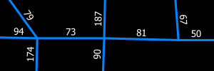
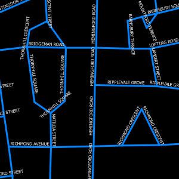
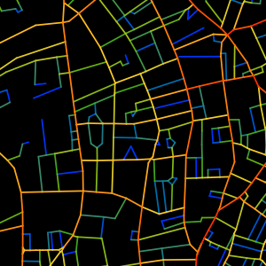
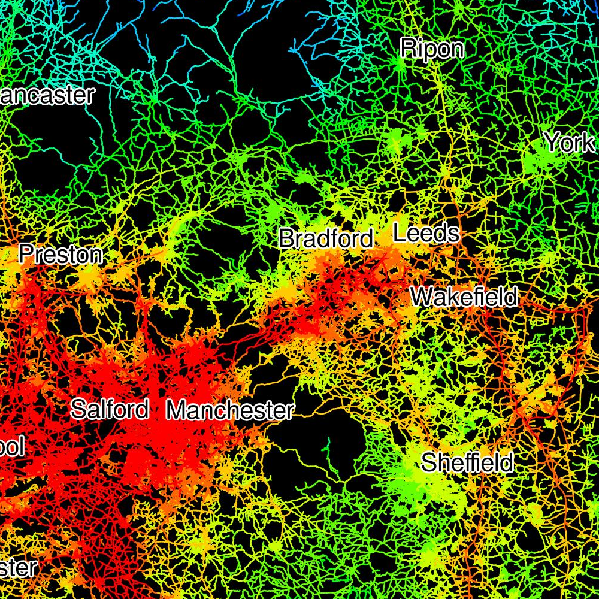
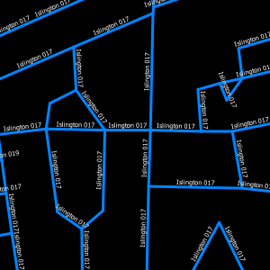

# Space Syntax OpenMapping
<!-- <a href="#access-data"></a>
<a href="#reference"></a>
<a href="#license"></a>
<a href="#bibliography"></a> -->

<p align="center">
</a>
</p>

<!-- TOC depthFrom:1 depthTo:6 withLinks:1 updateOnSave:1 orderedList:0 -->

- [Introduction](#introduction)
	- [OpenMapping](#openmapping)
	- [About Space Syntax Limited](#about-space-syntax-limited)
- [Access Data](#access-data)
- [Reference](#reference)
	- [Data Summary](#data-summary)
	- [Attribute Naming method](#attribute-naming-method)
	- [Attribute Reference](#attribute-reference)
	- [Build Methodology](#build-methodology)
- [License](#license)
	- [Source Data Licenses](#source-data-licenses)
	- [Attribution](#attribution)
- [Bibliography](#bibliography)

<!-- /TOC -->

## Introduction
**Space syntax** is a set of techniques for analysing spatial layouts and human activity patterns in urban areas. These techniques have been researched and applied to commercial projects around the world for over 30 years.

This has revealed that there are consistent spatial characteristics which relate to the way pedestrian activity, land use, values, crime and health outcomes are distributed across cities.

### OpenMapping
Space Syntax OpenMapping is a Great Britain wide dataset that includes analytic measures of the road network. All entities in the dataset have been coordinated with commonly used data collection boundaries, so that spatial characteristics can easily be compared to data at LSOA or Local Authority level.

The data is licensed under [CC BY-SA 4.0](#license). This allows people to use and modify the data as long as it is attributed to Space Syntax, and that any modifications are shared back under the same terms. By licensing the data in this way we hope to encourage wider exploration, innovation and application.

We are very interested in what people do with the data, so please get in touch with any questions, issues, ideas or experiments, either via <a href="mailto:info@spacesyntax.com?Subject=OpenMapping">info@spacesyntax.com</a> or the [**issues page**](https://github.com/spacesyntax/OpenMapping/issues).

### About Space Syntax Limited
Space Syntax Limited is a consultancy that applies these techniques to help shape and inform planning and design decisions. Find out more about Space Syntax Limited on [**our website**](https://www.spacesyntax.com).


## Access Data
Format  | Download |
--|--
**View Online on our website**  | <a href="https://www.spacesyntax.com/OpenMapping"></a>
GeoPackage  | <a href="https://github.com/spacesyntax/OpenMapping/releases/download/gb-v1/ssx_OpenMapping_gb_v1_gpkg.zip" download="ssx_OpenMapping_gb_v1_gpkg.zip"></a>
CSV  | <a href="https://github.com/spacesyntax/OpenMapping/releases/download/gb-v1/ssx_OpenMapping_gb_v1_csv.zip" download="ssx_OpenMapping_gb_v1_csv.zip"> </a>
GeoJSON  | <a href="https://github.com/spacesyntax/OpenMapping/releases/download/gb-v1/ssx_OpenMapping_gb_v1_geojson.zip" download="ssx_OpenMapping_gb_v1_geojson.zip"></a>
MIF (Mapinfo)  | <a href="https://github.com/spacesyntax/OpenMapping/releases/download/gb-v1/ssx_OpenMapping_gb_v1_mif.zip" download="ssx_OpenMapping_gb_v1_mif.zip"> </a>
Shapefile (ArcGIS)  | <a href="https://github.com/spacesyntax/OpenMapping/releases/download/gb-v1/ssx_OpenMapping_gb_v1_shp.zip" download="ssx_OpenMapping_gb_v1_shp.zip"> </a>

<!-- WMS API  | <a href="https://github.com/spacesyntax/OpenMapping/releases/download/gb-v1/ssx_OpenMapping_gb_v1_shp.zip" download="ssx_OpenMapping_gb_v1_shp.zip"> </a> -->

This package contains the following data:

Metadata:
+ `README.txt` - Text file outlining information on data package.
+ `ssx_openmapping_gb_v1_schema.json` - Machine readable table schema
+ `ssx_openmapping_gb_v1_column_headers.csv` - Column headers in csv format
+ `ssx_openmapping_gb_v1_sample.csv` - 5 row sample in csv format

Data:
+ `csv`/`geojson`/`gpkg`/`mif`/`shp` - containing the model in your chosen format
+ `qgis-styles` - QML style files compatible with QGIS, each file is named after the corresponding attribute in the model

Space Syntax recommend using the cross platform open source QGIS software for viewing and analysing the data.  [**Download QGIS**](https://www.qgis.org/) We also recommend using the [GeoPackage](http://www.geopackage.org/) version of the data as the modern & open standard for GIS data.

**Note** Due to the shapefile column limit of 10 characters, the shapefile version will have truncated column names, please refer to the metadata schema for the full column names.

## Reference

<script src='https://certificates.theodi.org/en/datasets/216167/certificate/badge.js'></script>

| Metadata              | Value                     |
|-----------------------|---------------------------|
| Name                 | Space Syntax OpenMapping |
| Formats   |  GeoJSON, GeoPackage, Shapefile, CSV, MIF |
| Data Type  | vector lines with text and numeric attributes  |
| Geometric Projection  | EPSG/SRID: 27700 (OSGB 1936 / British National Grid)  |  
| Version               | gb-v1                     |
| Published by          | [Space Syntax Limited](http://www.spacesyntax.com)      |
| License        | <a rel="license" href="http://creativecommons.org/licenses/by-sa/4.0/"> CC BY-SA 4.0</a> -  [Attribution](#license)            |
| Open Data Certificate   | <a href="https://certificates.theodi.org/en/datasets/216167/certificate/"></a> |

### Data Summary
Space Syntax OpenMapping cleans up and then explodes the road geometry of [OS Meridian 2](https://www.ordnancesurvey.co.uk/docs/user-guides/meridian-2-user-guide.pdf) (a simplified road network product by Ordnance Survey) into individual road segments. This means multiple road segments may represent only one road in the original Meridian data. The exploded road network is then analysed adapting graph measures of Betweeness Centrality (Choice) and Closeness Centrality (Integration) at scales of 2km, 10km, and 100km.

These scales were chosen considering the limitations of the Meridian 2 dataset (which doesn’t include all roads or pedestrian spaces), and research showing how cities typically operate across three scales.

### Attribute Naming method
The measure columns are named in the following way:
> `measure radius modifier`

types  |  description
--|--
`choice` `integration` `nodecount`  |  the type of calculation (see Full Table below)
 `2km` `10km` `100km` |  the distance around the road segment for which the value is calculated, this accounts for local, regional, and global connectivity respectively.
`log` `rank` |  The value has been normalised either by calculating the logarithm (base 10), or percent rank of the road segment. Raw space syntax values often distributed exponentially, logging them helps distribute them in order to see small variations. Across an entire country there are large variations between very large cities (e.g. London) and small towns (e.g. Didcot). Ranking is used so that the hierarchy of each settlement can be seen without being skewed by extremely large settlements. Ranking is done by calculating the rank of each segment in relation to those within the radius at which the measure is calculated. Original, unranked values are also included in the dataset.

### Attribute Reference
Column  | Visualisation  |  Description
--|--|--
`id` | | Unique integer id of a road segment
`metres` |  | Length of road segment in metres
`meridian_id` `meridian_gid` `meridian_code` `meridian_osodr` `meridian_number` `meridian_road_name` `meridian_class` `meridian_indicator`| | OS Meridian 2 derived columns. Refer to the [OS specification](https://www.ordnancesurvey.co.uk/docs/user-guides/meridian-2-user-guide.pdf) for more details.
`choice2km` `choice2kmlog` `choice2kmrank` `choice10km` `choice10kmlog` `choice10kmrank` `choice10km` `choice10kmlog`  `choice10kmrank` `choice100km` `choice100kmlog` |  | **Choice** <br> Choice is based on the graph measure of [Betweenness Centrality](https://en.wikipedia.org/wiki/Betweenness_centrality). Space syntax adapts this to measure how often a street segment appears on the simplest route between all other street segments in the network. The simplest route is defined as the route that undergoes the least total change in direction from start point to end point when linking all segments within a defined distance - e.g. 2,000m, 10,000m. We have included choice in the dataset as it often describes the distribution of movement. At 2,000m this will identify where pedestrian movement is likely to be higher, at 10km it will identify where vehicular movement is likely to be higher.
`integration2km` `integration10km` `integration100km`  |   |  **Integration** <br> Integration - Integration is based on the graph measure of [Closeness Centrality](https://en.wikipedia.org/wiki/Closeness_centrality). Space syntax adapts this to measure the number of street segments within a defined distance, accounting for their distance and change in direction from the starting segment. We have included Integration as it describes patterns of centrality
`oa11cd` `lsoa11cd` `lsoa11nm` `msoa11cd` `msoa11nm` `clad11cd` `clad11nm`  |    | **Census 2011 Geometry** <br> The network is pre linked to Office for National Statistics Census 2011 geometry codes for extensive statistical and spatial analysis at the following scales: <ul><li> Output Area (whole UK)</li><li>Lower Super Output area (England & Wales)</li><li>Middle Super Output area (England & Wales)</li><li>Combined Local Authority (Census 2011 definition)</li><li>Workplace Zones (Census 2011 definition)</li></ul>

### Build Methodology
The data is based on the road network from [OS Meridian 2](https://www.ordnancesurvey.co.uk/business-and-government/help-and-support/products/meridian2.html), a simplified geographic representation of Great Britain's road network.

- Combine layers: All OS Meridian 2 road shapefiles are loaded into a PostGIS database and combined into a single layer with a new `class` column signifying `aroad`, `broad`, `motorway` or `minor`
- Clean geometry: Duplicates, overlaps, erroneous islands and invalid geometries are removed
- Explode geometry: Roads are exploded into individual segments using the [Place Syntax Tool](https://www.smog.chalmers.se/pst) plugin in QGIS 2.
- Calculate measures: Space Syntax measures are processed using the [Place Syntax Tool](https://www.smog.chalmers.se/pst) plugin in QGIS 2.
- ONS Boundary data imported into PostGIS database

The processed road network is linked to [ONS Census 2011 Output Areas](https://www.ons.gov.uk/methodology/geography/ukgeographies/censusgeography) based on the midpoint of a road segment using PostGIS. It should be noted that OS Meridian is a discontinued product that may not accurately reflect the present layout of streets. Furthermore, the automatic cleaning and correction undertaken to the geometry does not guarantee fully accurate data.

If users find errors such as disconnected segments or isolated systems please report them on our [**issues page**](https://github.com/spacesyntax/OpenMapping/issues) so we can compile an error log and improve the map.

**Disclaimer** - Space Syntax take no responsibility for the accuracy of the data or any decision made based on its use.

## License
<a rel="license" href="http://creativecommons.org/licenses/by-sa/4.0/"></a><br /><br />This work is licensed under a <a rel="license" href="http://creativecommons.org/licenses/by-sa/4.0/">Creative Commons Attribution-ShareAlike 4.0 International License</a>

You are free to:

Share — copy and redistribute the material in any medium or format
Adapt — remix, transform, and build upon the material
for any purpose, even commercially.

This license is acceptable for Free Cultural Works.

The licensor cannot revoke these freedoms as long as you follow the license terms.

Under the following terms:

Attribution — You must give appropriate credit, provide a link to the license, and indicate if changes were made. You may do so in any reasonable manner, but not in any way that suggests the licensor endorses you or your use.

ShareAlike — If you remix, transform, or build upon the material, you must distribute your contributions under the same license as the original.

### Source Data Licenses
External Data Source  | URL  |   License
--|---|---
OS Meridian 2  | https://www.ordnancesurvey.co.uk/business-and-government/help-and-support/products/meridian2.html  | [Open Government License](https://www.nationalarchives.gov.uk/doc/open-government-licence/version/3/)
ONS Boundary  | http://geoportal.statistics.gov.uk/  | [Open Government License](https://www.nationalarchives.gov.uk/doc/open-government-licence/version/3/)

### Attribution
You must use this full attribution for the release data.

Online Attribution:
```
Space Syntax OpenMapping © 2018 Space Syntax Limited. CC BY-SA 4.0.
Attribution: https://github.com/spacesyntax/OpenMapping
Space Syntax™ is a registered trademark of Space Syntax Limited. All rights reserved.
```

Text Attribution:
```
Space Syntax OpenMapping © 2018 Space Syntax Limited
This work is licensed under a Creative Commons Attribution-ShareAlike 4.0 International License
Space Syntax™ is a registered trademark of Space Syntax Limited. All rights reserved.
Contains Ordnance Survey data © Crown copyright and database right 2018
Contains National Statistics data © Crown copyright and database right 2018
```

**All files in the `img` folder in this repository are © 2018 Space Syntax Limited and do not fall under the [CC BY-SA 4.0](#license) license**

## Bibliography
`Turner, A. (2001) Angular Analysis. In Proceedings of the 3rd International Symposium of Space Syntax`

`Turner, A. (2004), DepthMap4: A Researcher’s Handbook, UCL`

`Hillier , B. & Iida, S. (2005), Network and psychological effects in urban movement, In: A.G. Cohn and D.M. Mark (Eds.): COSIT 2005, LNCS 3693`

`Hillier, B., Yang, T., Turner, A. (2012) Advancing DepthMap to advance our understanding of cities: comparing streets and cities, and streets to cities. In: Greene, M and Reyes, J and Castro, A, (eds.) 8th International Space Syntax Symposium. Pontificia Universidad Catolica de Chile: Santiago, Chile.`

`Serra, M., Hillier, B., Karimi, K. (2015) Exploring countrywide spatial systems: Spatio-structural correlates at the regional and national scales. Proceedings of the 10th International Space Syntax Symposium.`

`Place Syntax Tool (PST)- https://www.smog.chalmers.se/pst`

`PST is developed by KTH School of Architecture, Chalmers School of Architecture (SMoG) and Spacescape AB.`

`OS Meridian 2 - https://www.ordnancesurvey.co.uk/business-and-government/help-and-support/products/meridian2.html`

`ONS Census Boundary - https://www.ons.gov.uk/methodology/geography/licences`
